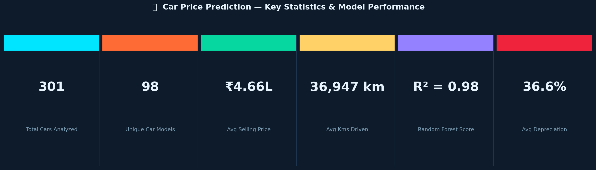
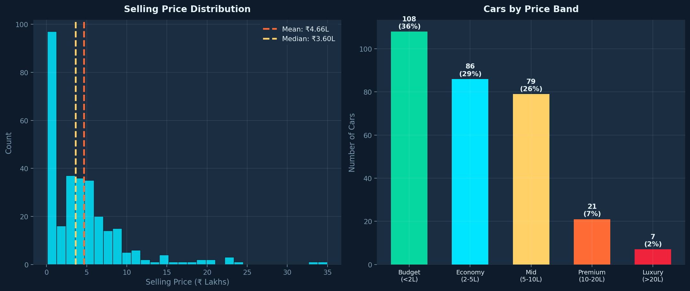
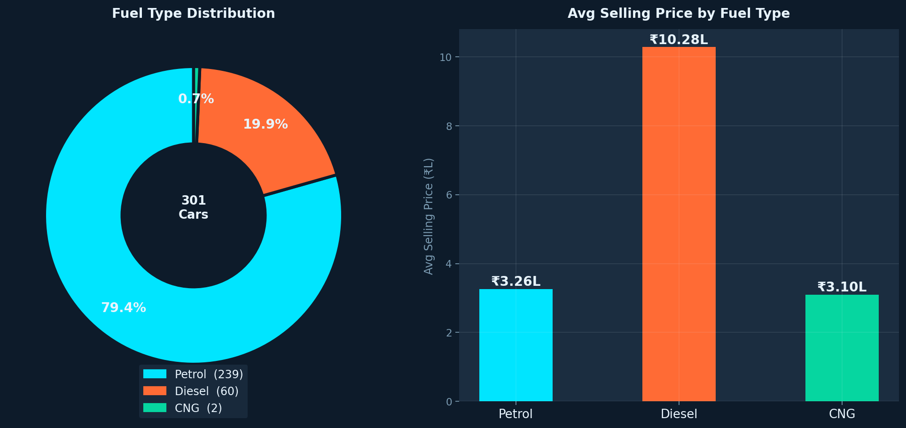
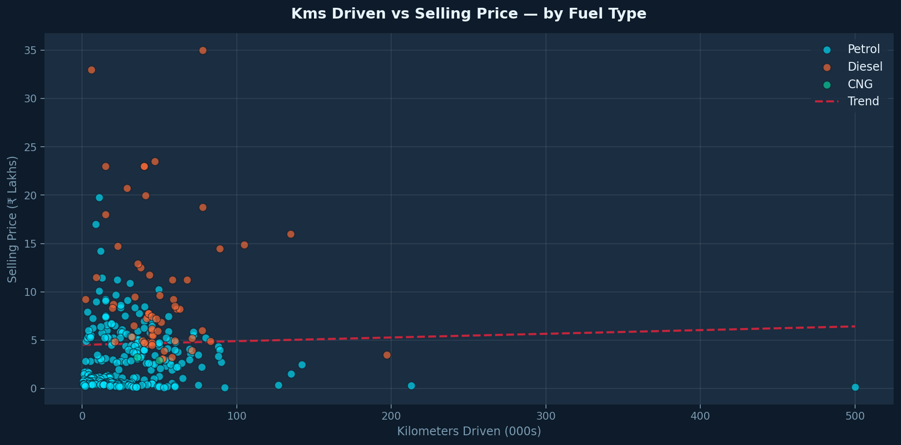
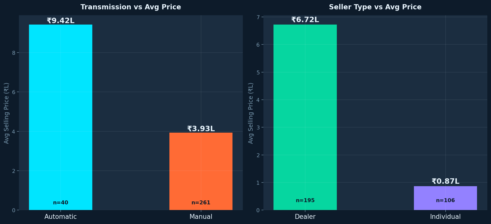
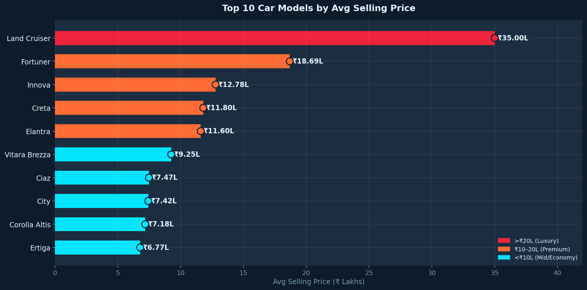
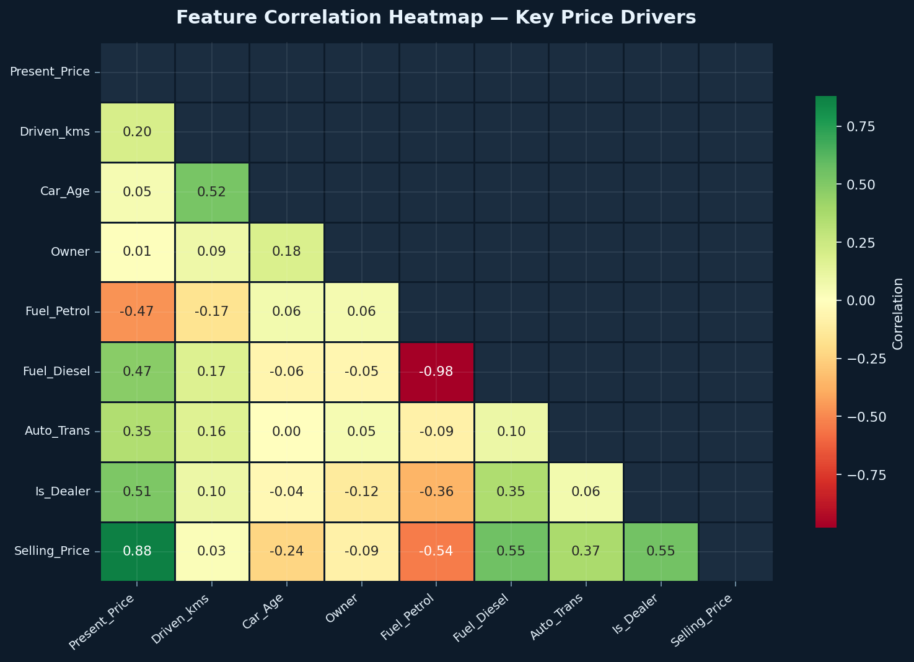

# 🚗 Car Price Prediction — Machine Learning & Market Valuation Intelligence
### Predicting Used Car Resale Value with 96.57% Accuracy | Python · Scikit-learn · Random Forest · EDA

> **Putting data-backed pricing in the hands of buyers, sellers, and dealers** | Python · Random Forest · Linear Regression · EDA · Feature Engineering

---


---

### 🏷️ Keywords
`Machine Learning` · `Predictive Modeling` · `Regression Analysis` · `Random Forest` · `Exploratory Data Analysis` · `Feature Engineering` · `Data Visualization` · `Scikit-learn` · `Business Intelligence` · `Python` · `Data Cleaning & Transformation`

---

## 📌 Business Problem

Used car pricing in India is notoriously opaque. Dealers quote prices based on intuition. Buyers overpay because they lack market benchmarks. Sellers undersell because they don't know which features actually drive value.

This project cuts through that noise by building a machine learning model that predicts a car's fair resale value based on its actual attributes — giving every stakeholder a **data-backed number to negotiate around**.

---

## 🎯 Objective

Develop an interpretable, high-accuracy regression model that predicts used car selling prices, surfaces key value drivers, and compares Random Forest vs Linear Regression to identify the best production-ready model.

---

## 📊 Dataset & Model Snapshot

| Property | Details |
|---|---|
| **File** | `old_car_data.csv` |
| **Records** | 301 used car listings |
| **Target Variable** | `Selling_Price` (₹ Lakhs) |
| **Features** | Car_Name, Year, Present_Price, Driven_kms, Fuel_Type, Selling_type, Transmission, Owner |
| **Fuel Types** | Petrol (239) · Diesel (60) · CNG (2) |
| **Transmission** | Manual (261) · Automatic (40) |
| **Derived Feature** | `Car_Age = 2024 − Year` |

---

## 🛠 Tools & Technologies

| Layer | Stack |
|---|---|
| **Machine Learning** | Scikit-learn — RandomForestRegressor, LinearRegression |
| **Data Analysis** | Python — Pandas, NumPy |
| **Data Visualization** | Matplotlib, Seaborn |
| **Feature Engineering** | LabelEncoder, Car_Age derivation, train/test split (80/20) |
| **Model Persistence** | Pickle (.pkl) — Random Forest model saved |
| **Notebook Environment** | Jupyter Notebook |
| **Version Control** | Git & GitHub |

---

## 🔍 Analysis Approach

1. **Data Cleaning & Audit** — Validated 301 records across 9 columns. Zero missing values. Identified right-skewed price distribution.
2. **Feature Engineering** — Derived `Car_Age` from manufacture year. Applied LabelEncoder to categorical variables.
3. **Exploratory Data Analysis** — Analyzed price distributions by fuel type, transmission, seller type, ownership, and year to surface pricing patterns.
4. **Model Training & Comparison** — Random Forest (100 estimators) vs Linear Regression on 80/20 train/test split. Evaluated with R², MAE, Actual vs Predicted plots.
5. **Feature Importance Analysis** — Ranked all features by Random Forest importance to identify true price drivers.

---

## 📈 Key Insights

- 🌲 **Random Forest R² = 0.9657** — explains 96.57% of price variance, production-ready for dealer pricing tools
- 💡 **Present_Price = 86.7% feature importance** — ex-showroom price is the dominant resale predictor by a massive margin
- ⛽ **Diesel commands 3.15× price premium** — ₹10.28L avg vs ₹3.26L petrol; the strongest categorical pricing signal
- 🚗 **Automatic transmission = 2.4× manual price** — ₹9.42L vs ₹3.93L; automatic is a major value-add
- 🏪 **Dealer prices = 7.7× individual seller** — ₹6.72L vs ₹0.87L; dealer certification adds significant perceived value
- 📉 **36.6% average depreciation** from present to selling price — used car market loses over a third of value
- 🏆 **Land Cruiser tops at ₹35L**, Fortuner at ₹18.7L — Toyota dominates the top resale value rankings
- 📅 **Budget segment (<₹2L) = 35.9%** of all listings — market skews heavily toward affordable used cars

---

## 📊 Model Performance Comparison

| Metric | Random Forest 🏆 | Linear Regression |
|---|---|---|
| **R² Score** | **0.9657** | 0.8465 |
| **MAE** | **₹0.59L** | ₹1.21L |
| **Error Reduction** | **51.2% less error** | Baseline |
| **Model File** | `random_forest_regression_model.pkl` | — |

---

## 📊 Dashboard & Visualizations

### 🔢 KPI Summary


### 📊 Price Distribution & Price Bands


### ⛽ Fuel Type Analysis


### 📅 Year vs Selling Price — Appreciation Curve


### 📍 Kms Driven vs Selling Price (Scatter)


### ⚙️ Transmission & Seller Type Analysis


### 🏆 Top 10 Car Models by Avg Price


### 🔥 Feature Correlation Heatmap


### 🎯 Actual vs Predicted — RF & LR Comparison


### 📈 Random Forest Feature Importance


---

## 💡 Business Recommendations

1. **Deploy RF model as a live dealer pricing tool** — R²=0.9657 and MAE=₹0.59L makes it production-ready. Dealers input specs and get instant fair-market valuation.
2. **Sell before Year 7–8** — Depreciation accelerates sharply after that point. Optimal resale window: Years 3–6.
3. **Buyers: use model as negotiation baseline** — If listed price exceeds prediction by 15%+, there's statistical room to push back.
4. **Prioritize diesel & automatic inventory** — Both command massive premiums and attract serious buyers.
5. **Financing companies: factor Car_Age and Kms in LTV models** — Present_Price dominates prediction, but age and kms are the best risk-adjusted depreciation signals.

---

## 📂 Project Structure

```
car-price-prediction-ml/
├── 📁 data/
│   └── old_car_data.csv
├── 📁 notebooks/
│   ├── Car_Price_Prediction_Machine_Learning.ipynb
│   └── predict-used-car-prices-linearregression.ipynb
├── 📁 models/
│   └── random_forest_regression_model.pkl
├── 📁 scripts/
│   └── generate_visuals.py
├── 📁 images/
│   ├── 01_kpi_banner.png  ...  10_feature_importance.png
├── requirements.txt
└── README.md
```

---

## 🚀 How to Run

```bash
git clone https://github.com/surya-prakash-data-analyst/car-price-prediction-ml.git
cd car-price-prediction-ml
pip install -r requirements.txt
jupyter notebook notebooks/Car_Price_Prediction_Machine_Learning.ipynb
```

```python
# Load saved model
import pickle
model = pickle.load(open('models/random_forest_regression_model.pkl', 'rb'))
prediction = model.predict([[present_price, kms, year, fuel, seller, trans, owner]])
```

---

## 📬 Contact

**Surya Prakash** — Data Analyst  
📍 Hyderabad, India  
🔗 [LinkedIn](https://www.linkedin.com/in/surya-prakash-data-analyst) · 🐙 [GitHub](https://github.com/surya-prakash-data-analyst)
📧 suryaprakash1892@gmail.com
---

> *"A model is only as useful as the decision it enables. This one was built to put fair pricing in the hands of the people who need it most."*

---
*Built with real data · 301 cars · 98 models · R²=0.9657 · MAE=₹0.59L · Production-ready model saved.*
