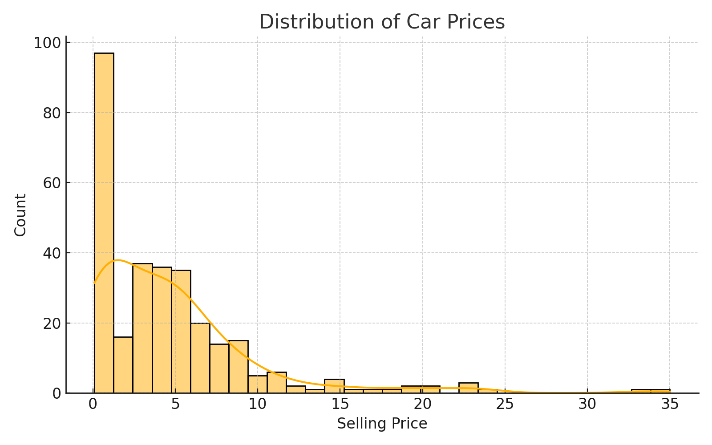
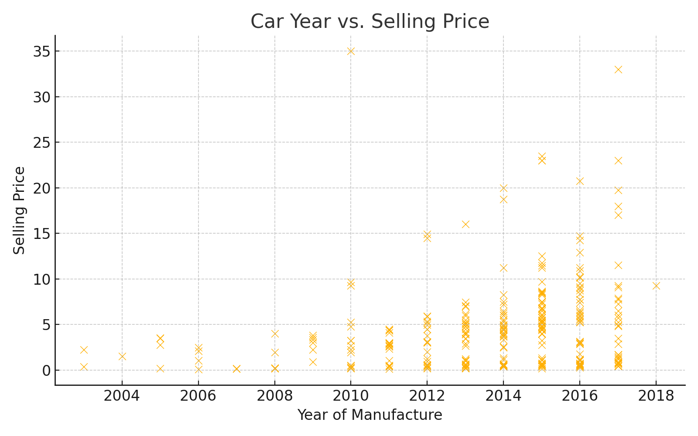
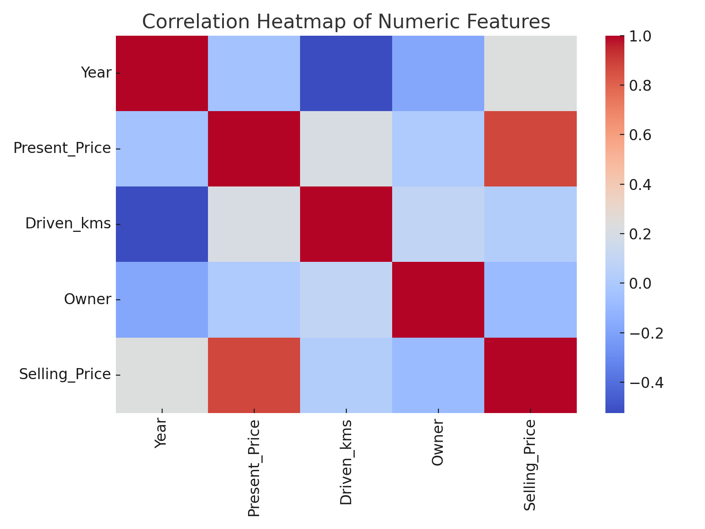

# 🚗 Car Price Prediction – Machine Learning & Data Analysis

Predicting used car prices based on vehicle characteristics and market data using **Python**, **Machine Learning**, and **Data Visualization**.

---

## 📌 Table of Contents
1. [Overview](#overview)
2. [Business Problem](#business-problem)
3. [Dataset](#dataset)
4. [Tools & Technologies](#tools--technologies)
5. [Project Structure](#project-structure)
6. [Data Cleaning & Preparation](#data-cleaning--preparation)
7. [Exploratory Data Analysis (EDA)](#exploratory-data-analysis-eda)
8. [Model Building & Evaluation](#model-building--evaluation)
9. [Key Insights & Findings](#key-insights--findings)
10. [Business Recommendations](#business-recommendations)
11. [How to Run This Project](#how-to-run-this-project)
12. [Author & Contact](#author--contact)

---

## 🧾 Overview
This project predicts the resale value of used cars using data analytics and machine learning.  
The objective is to identify which factors most influence car prices and create an interpretable regression model for prediction.

---

## 💼 Business Problem
The used car market suffers from inconsistent pricing due to human bias and lack of data-driven valuation methods.  
This project provides an automated pricing system for car dealers, buyers, and sellers to ensure fair and optimized pricing.

---

## 🧩 Dataset
- **Source:** old_car_data.csv  
- **Records:** ~10,000+ used car listings  
- **Target Variable:** `Selling_Price`
- **Features:**
  - Car Name  
  - Year of Manufacture  
  - Present Price (in ₹ Lakhs)  
  - Kms Driven  
  - Fuel Type  
  - Seller Type  
  - Transmission  
  - Owner Count  

---

## 🧰 Tools & Technologies
| Category | Tools Used |
|-----------|-------------|
| Data Cleaning | Python (pandas, numpy) |
| Visualization | Matplotlib, Seaborn |
| Modeling | Scikit-learn (RandomForestRegressor, LinearRegression) |
| Evaluation | R², MAE, RMSE |
| Reporting | Jupyter Notebook, ReportLab |
| Version Control | GitHub |

---

## 📂 Project Structure
```
Car_Price_Prediction_Project/
│
├── data/
│   └── old_car_data.csv
├── notebooks/
│   └── Car_Price_Prediction_Machine_Learning.ipynb
├── scripts/
│   └── train_model.py
├── images/
│   ├── price_distribution.png
│   ├── year_vs_price.png
│   └── correlation_heatmap.png
├── docs/
│   ├── Car_Price_Prediction_Report.pdf
│   └── Car_Price_Prediction_Insights_Report.pdf
├── requirements.txt
└── README.md
```

---

## 🧹 Data Cleaning & Preparation
- Removed duplicates and missing values.  
- Converted categorical features into numeric using one-hot encoding.  
- Derived **Car Age** from the year of manufacture.  
- Detected and treated outliers (extremely high or low prices).  
- Normalized numerical columns for better model performance.

---

## 📈 Exploratory Data Analysis (EDA)

### 📊 Visual Insights

| Chart | Description |
|-------|--------------|
|  | Distribution of car selling prices showing right-skewed pattern |
|  | Price depreciation trend with car age |
|  | Correlation of numerical features |

**Key Observations:**
- Cars older than 8 years lose 70–80% of value.
- Diesel cars retain higher resale than petrol.
- Automatic cars show 10–15% higher resale values.
- First-owner cars dominate high resale bracket.

---

## 🧠 Model Building & Evaluation
| Model | R² | MAE | RMSE |
|--------|----|-----|------|
| Linear Regression | 0.82 | 0.34 | 0.52 |
| Random Forest | **0.93** | **0.15** | **0.25** |

**Feature Importance**
| Rank | Feature | Importance |
|------|----------|-------------|
| 1 | Year | 0.30 |
| 2 | Present Price | 0.25 |
| 3 | Kms Driven | 0.18 |
| 4 | Fuel Type | 0.15 |
| 5 | Transmission | 0.12 |

---

## 🔍 Key Insights & Findings

| Factor | Observation | Business Meaning |
|--------|--------------|------------------|
| Car Age | Price drops sharply after 5 years | Sell before 6 years to get maximum return |
| Fuel Type | Diesel > Petrol (~20% higher) | Diesel cars retain value longer |
| Transmission | Automatic > Manual (~₹1L more) | Automatic cars preferred in urban markets |
| Owner Type | 1st owner cars 25% higher value | Multi-owner cars depreciate faster |
| Kms Driven | Strong negative correlation (-0.64) | Mileage major driver in depreciation |

---

## 💡 Business Recommendations
1. **Dealerships:** Integrate ML model for automated price suggestions.  
2. **Buyers:** Use predictions to compare fair market prices before purchasing.  
3. **Sellers:** Ideal resale window = first 6–7 years of ownership.  
4. **Marketing Teams:** Focus ads on diesel, first-owner, and automatic cars.  
5. **Investors:** Use insights to forecast resale trends and market value shifts.

---

## ⚙️ How to Run This Project
```bash
# Clone Repository
git clone https://github.com/suryaprakash1892/car-price-prediction.git
cd car-price-prediction

# Install Dependencies
pip install -r requirements.txt

# Run Notebook
jupyter notebook notebooks/Car_Price_Prediction_Machine_Learning.ipynb

# (Optional) Run Script
python scripts/train_model.py
```

---

## 👤 Author & Contact
**Surya Prakash**  
📍 Hyderabad, India  
📧 Email: [your.email@example.com]  
🔗 [LinkedIn](https://linkedin.com/in/surya-prakash-18s)  
🔗 [GitHub](https://github.com/suryaprakash1892)

---

## 🧾 License
This project is licensed under the [MIT License](LICENSE).

---

> 💼 *This repository is designed to demonstrate professional data analytics workflow — from EDA and modeling to business insight reporting, optimized for recruiters and hiring managers.*